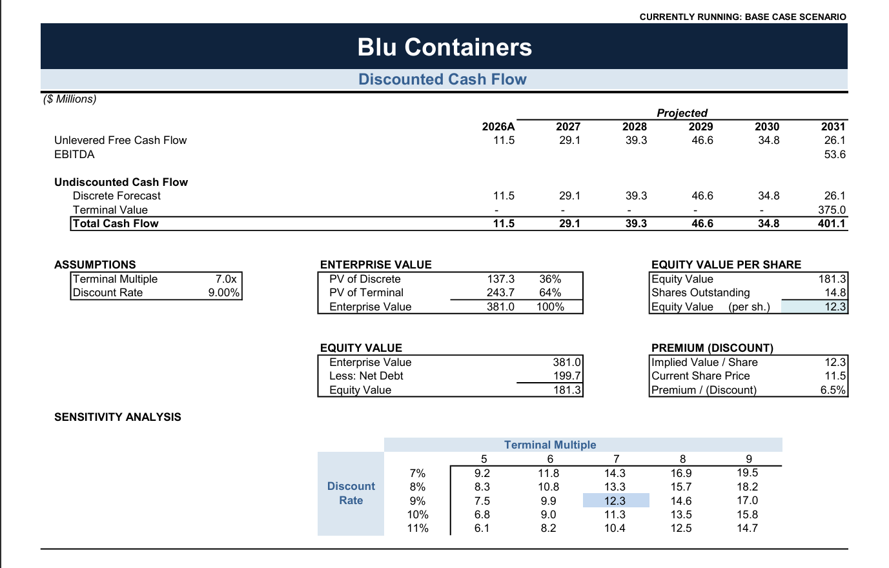

# Blu Containers — DCF Valuation Model

A 5-year integrated 3-statement financial model and discounted cash flow valuation for Blu Containers, built entirely in Excel with a scenario-driven forecast engine.



## Overview

The model forecasts Blu Containers' income statement, balance sheet and cash flow from 2027–2031 off a 2026A base year, then values the business using an exit-multiple discounted cash flow method. Every driver — pricing, cost inflation, sales volume — runs through a single scenario switch, so Base, Best and Worst cases roll straight through to the valuation without touching a formula.

**Valuation summary (Base Case):**
- **Implied value per share: $12.25**, against a $11.50 current share price — a **6.5% premium**
- **Enterprise Value: $381.0M** (64% of value from the terminal value)
- **Equity Value: $181.3M** after deducting $199.7M of net debt
- Discount rate **9.0%**, exit multiple **7.0x** EBITDA

## Model structure

| Tab | Purpose |
|---|---|
| **Cover** | Engagement details, valuation summary, contents |
| **Summary** | Scenario output — Base, Best and Worst case income statement summaries |
| **Assumptions** | Key operating and valuation inputs (pricing, costs, capex, working capital, debt/equity) |
| **Scenarios** | Scenario switch and the underlying driver sets for inflation, pricing and volume |
| **Model** | Integrated 3-statement model and DCF valuation, plus income tax, and variable/fixed/semi-variable cost detail |

## Key assumptions

- 5-year discrete forecast (2027–2031) with exit-multiple terminal value
- Three scenarios (Base / Best / Worst) driving inflation, unit pricing and sales volume growth
- 420,000-unit annual factory capacity, ramping from 86% to 100% utilization over the forecast
- 35% corporate tax rate, straight-line depreciation
- Working capital and debt schedules feed directly into unlevered free cash flow

## Tools

- **Microsoft Excel** — full 3-statement build, scenario toggle, DCF and sensitivity analysis

## Repo contents

```
├── Model/
│   ├── Blu Containers DCF Model.xlsx   # The full model
│   └── Blu Containers DCF Model.pdf    # Printable/read-only export of all tabs
└── Assets/
    └── DCF.png                         # DCF output screenshot (Base Case)
```

## Getting started

1. Open `Model/Blu Containers DCF Model.xlsx` in Excel.
2. Go to the **Scenarios** tab and use the scenario switch to toggle between Base, Best and Worst case.
3. The **Model** tab's DCF section and the **Summary** tab update automatically to reflect the selected scenario.

---
*This model is prepared for illustrative and analytical purposes only and does not constitute investment advice. Figures are estimates based on stated assumptions and are subject to change.*

**Prepared by:** Chungu Kapambwe
